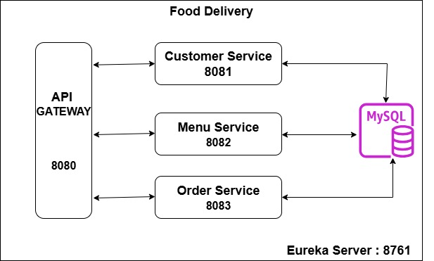
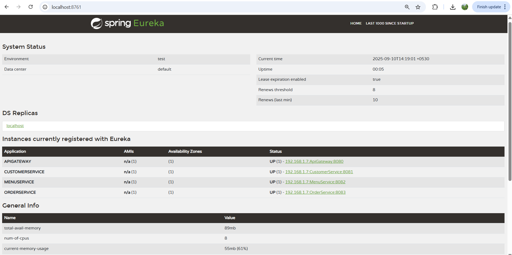
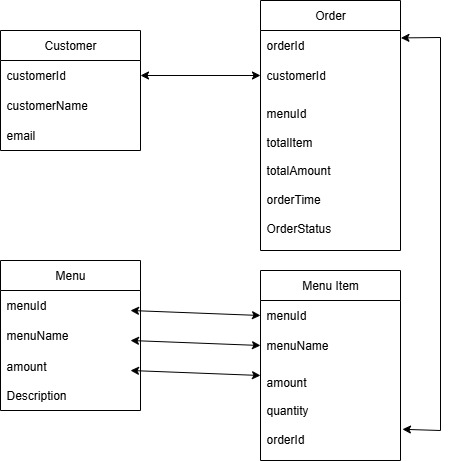

# Food Delivery - Menu Service

## 📌 Overview
The **Food Delivery Application** is a microservices-based system designed to handle customer management, menu operations, and order processing.  
This repository contains the **Menu Service** which manages menu items for restaurants.
  
*High-Level Design of Food Delivery Application*

  
*Eureka Server*

  
*Database Schema*

---

## 🚀 Service Details
This is the **Menu Service** for the Food Delivery application.  
- Manages **menu items**.  
- Provides APIs to **add, update, delete, and fetch menus**.  
- Works closely with **Order Service** when customers place orders.  

Endpoints (examples):  
- `POST /menuService/add` → Add new menu item  
- `GET /menuService/{id}` → Get menu item  
- `PUT /menuService/update` → Update menu item  
- `DELETE /menuService/{id}` → Delete menu item  

---

## 🔗 Other Services
- [Service Registry](https://github.com/saurabhkumarr99/FoodDelivery-ServiceRegistry)  : Acts as Eureka server for service discovery
- [API Gateway](https://github.com/saurabhkumarr99/FoodDelivery-ApiGateway)  : Acts as the single entry point for all client requests.
- [Customer Service](https://github.com/saurabhkumarr99/FoodDelivery-CustomerService) : manages customer-related operations.
- [Menu Service](https://github.com/saurabhkumarr99/FoodDelivery-MenuService)  :  Manages menu items for restaurants
- [Order Service](https://github.com/saurabhkumarr99/FoodDelivery-OrderService)  : handles all order-related operations.

---

## ⚙️ Setup Instructions
1. Setup **MySQL Database**  
   ```sql
   CREATE DATABASE FoodDelivery;
2. Git clone all services
3. Download Dependencies
4. Start Application

---
## Author - [Saurabh Kumar Rai](https://www.linkedin.com/in/saurabh-kumar-rai-36531a222/)
